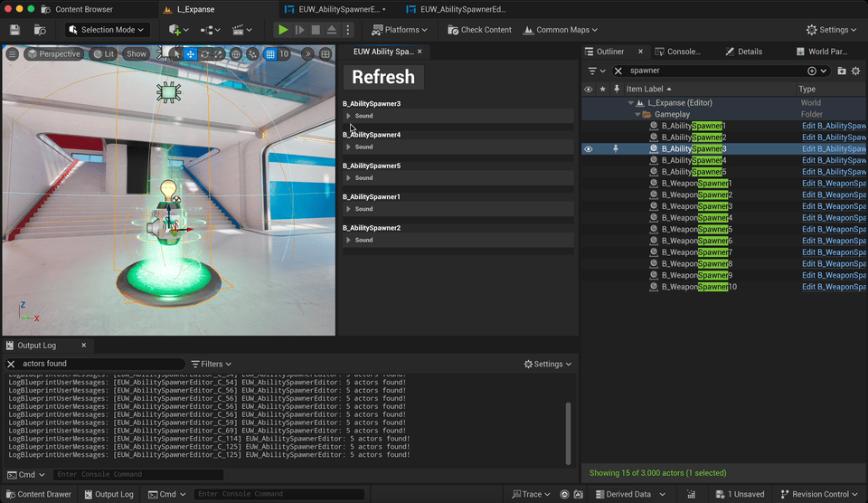

# UE5 Editor Utility Widget Tutorial Content Plugin

UE5 content plugin containing the Editor Utility Widget example of
[this tutorial blog post](https://hartung.studio/blog/2024-04-21-intro-to-ue5-editor-utility-widgets).

## Requirements

The editor utility widget was tested in UE `5.3` and is made to work with the
`L_Expanse` level of [Project Lyra](https://dev.epicgames.com/documentation/en-us/unreal-engine/lyra-sample-game-in-unreal-engine).

## Installation

Download the `.zip` from the release page and copy the `MHEUWTutorial` folder to the `Plugins` folder of your Project Lyra Game.

## Usage

Find the plugin in your content browser and use `right click -> Run editor utility widget`
on the `EUW_AbilitySpawnerEditor` editor utlity widget.